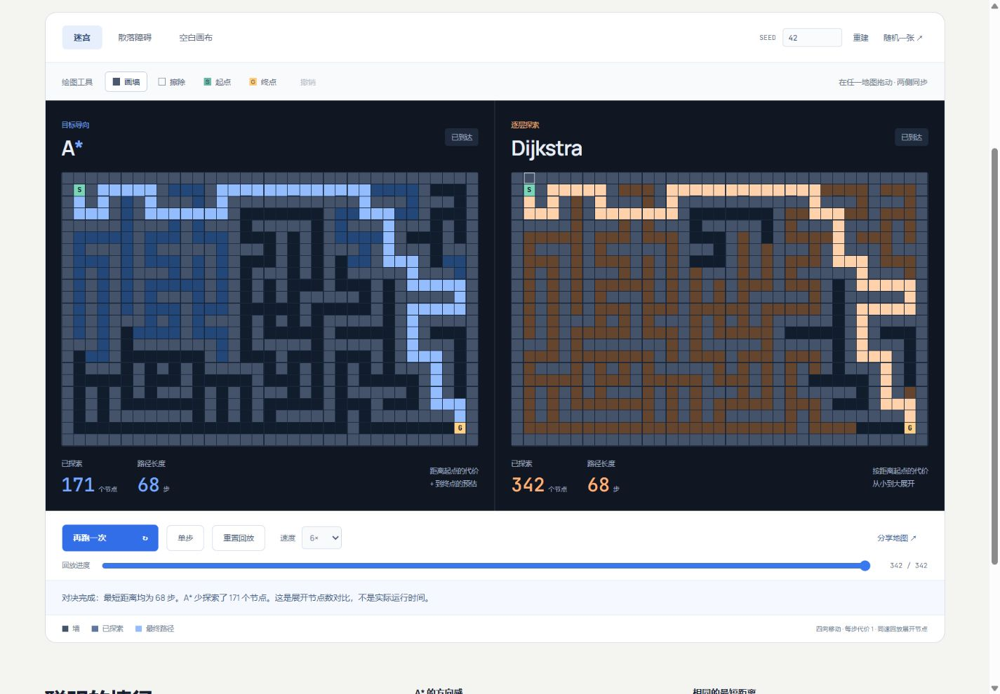

# Pathfinder Arena

**同一张地图，两种寻路策略。亲手画出障碍，看 A\* 与 Dijkstra 如何抵达终点。**

[在线体验](https://wangchuan2003-a11y.github.io/pathfinder-arena/) · [报告问题](https://github.com/wangchuan2003-a11y/pathfinder-arena/issues)



## 可以做什么

- **公平对照**：两侧共享一张 35 × 23 网格，同步展示真实探索顺序、展开节点数和最短路径长度。
- **直接编辑**：画墙、擦除、移动起点和终点；支持鼠标、触屏及键盘操作。
- **可重复实验**：使用种子生成迷宫或散点障碍，也可从空白地图开始。
- **看清过程**：运行、暂停、单步、重放与倍速播放，观察搜索如何推进。
- **分享地图**：将地图编码在链接中；复制失败时可手动复制链接。

## 如何读懂比较

网格只允许上下左右移动，每一步代价均为 1。Dijkstra 按已知距离探索；A\* 使用相同的距离信息，加上到终点的 **Manhattan 距离**作为启发式。

在这些条件下，两种算法找到的最短路径长度相同，但具体路径可能不同。改变障碍、起终点或种子，能看到探索范围如何变化。地图不可达时，界面会明确显示无路可走。

**展开节点数用于观察搜索策略，不是性能跑分。** 播放速度只控制演示节奏，不能用来比较算法耗时；A\* 也不承诺在所有地图上都比 Dijkstra 展开更少的节点。

## 本地运行

需要 **Node.js 22** 与 npm。

```sh
npm ci
npm run dev
```

打开 [http://127.0.0.1:5184](http://127.0.0.1:5184)。项目使用 TypeScript、Vite 与原生 DOM，无需 API 密钥。

## 验证与构建

```sh
# 编译寻路核心并运行 Node.js 测试
npm test

# TypeScript 检查与生产构建
npm run build

# 首次运行浏览器测试前安装 Chromium
npx playwright install chromium

# 桌面 1440 × 1000、手机 390 × 844
npm run test:e2e
```

浏览器测试通过 Playwright 自动启动 `http://127.0.0.1:4184` 的生产预览服务，因此需要先完成构建。生产文件输出到 `dist/`。

## 发布

GitHub Actions 对 `main` 分支推送和 Pull Request 执行依赖安装、核心测试、构建与 Chromium 浏览器测试。仅 `main` 分支的非 Pull Request 运行在检查通过后上传并部署 GitHub Pages。

仓库的 **Settings → Pages → Source** 应选择 **GitHub Actions**。Vite 使用相对资源路径，支持部署在 `/pathfinder-arena/` 项目路径下。

## License

[MIT](LICENSE) © 2026 wangchuan2003-a11y
