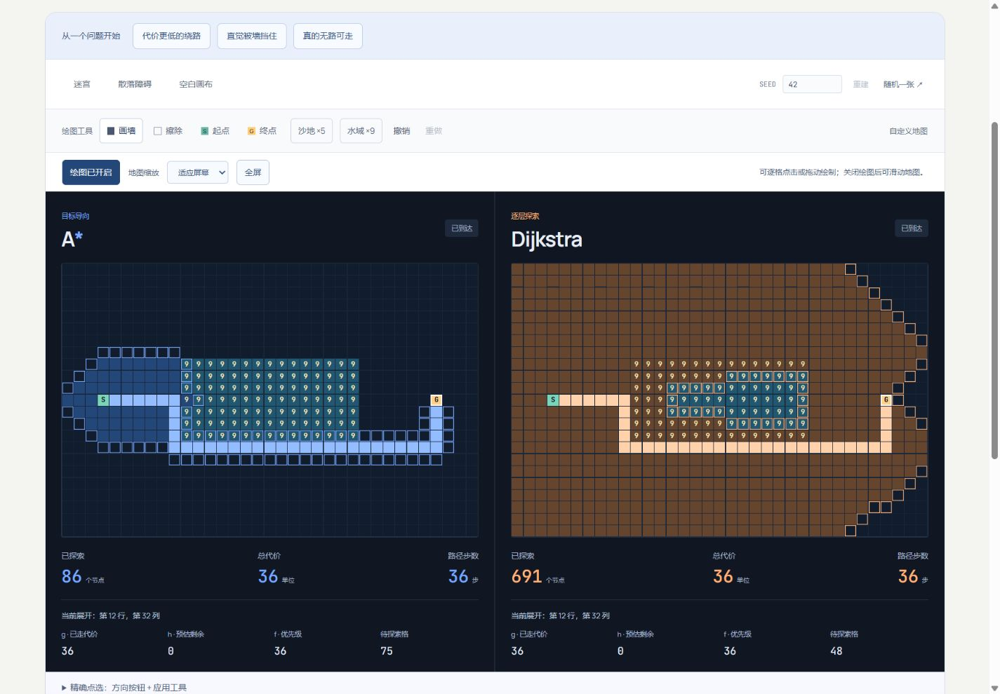

# Pathfinder Arena

**v2.1.0 · 同一张地图，两种寻路策略。画下障碍和地形，看 A\* 与 Dijkstra 如何选择路线。**

[在线体验](https://wangchuan2003-a11y.github.io/pathfinder-arena/) · [更新记录](CHANGELOG.md) · [实现参考](docs/REFERENCES.md) · [报告问题](https://github.com/wangchuan2003-a11y/pathfinder-arena/issues)



## Language / 语言

Use the language selector to switch between English and Simplified Chinese without resetting your map or replay. Language, zoom and speed are stored only in this browser.

语言菜单可随时切换中文和英文；草稿管理可恢复进入页面前的地图，或清除已保存的草稿。清除不会删除当前画面，也不会重置语言等偏好。

## 可以做什么

- **比较最低代价**：两侧共享 35 × 23 地图，分别显示探索节点、总代价和路径步数。普通格成本 1、沙地 5、水域 9。
- **拆开每个决定**：暂停、单步、倍速和进度回放；观察当前节点、待探索边界，以及 `g / h / f`。
- **亲手修改地图**：画墙、擦除、设置起终点、绘制地形，支持撤销和重做。触屏可切换浏览/绘图、放大地图，或用方向按钮精确点选。
- **保存与交换**：本机草稿自动保存；分享链接兼容旧地图；导入/导出 JSON，导出当前双板 PNG。
- **从问题开始**：三个教学场景——代价更低的绕路、直觉被墙挡住、真的无路可走。也可使用带种子的迷宫、散落障碍或空白画布。

## 如何读懂比较

地图只允许上下左右移动，进入一个格子时支付它的地形成本，起点成本从 0 开始。A\* 使用 Manhattan 距离估计剩余代价；这里每步成本至少为 1，因此该估计不会高估最优剩余代价。Dijkstra 不使用启发式，按累计成本探索。

两种算法应找到相同的**最低总代价**，具体路径与步数可能不同。`g` 是起点到当前节点的累计代价，`h` 是剩余代价估计，`f = g + h` 是优先级；Dijkstra 的 `h = 0`。待探索数量统计尚待处理的唯一节点。

**展开节点数用于观察搜索策略，不是运行时间跑分。** 播放速度只控制观看节奏；A\* 不保证在每张地图上都展开更少节点。算法依据和适用边界见[参考说明](docs/REFERENCES.md)。

## 操作提示

手机默认使用浏览模式，便于滑动页面和放大的地图。开启绘图后可点按或拖动；不想精确点小格子时，展开“精确点选”，用方向按钮移动，再“应用当前工具”。

| 操作                                    | 快捷键                            |
| --------------------------------------- | --------------------------------- |
| 播放 / 暂停；单步                       | `P`；`N`                          |
| 画墙 / 擦除 / 起点 / 终点 / 沙地 / 水域 | `1`–`6`                           |
| 撤销；重做                              | `Ctrl/⌘ Z`；`Ctrl/⌘ Shift Z`      |
| 进入地图；移动焦点；应用工具            | `Tab`；方向键；`Space` 或 `Enter` |

播放和工具快捷键用于焦点在地图及输入框之外时；地图内的方向键与确认键用于编辑。修改地图会清除旧搜索结果，“重置回放”保留地图。

## 数据保存在哪里

地图计算、JSON 读取和图片生成都在浏览器内完成。项目没有地图上传接口，也不需要账号、API 密钥或后端。

自动草稿仅保存在**当前浏览器、当前站点的 localStorage**，不会跨设备同步；清除站点数据或禁用存储可能使草稿不可用。撤销历史保留在当前页面内，刷新后不恢复。重要地图可导出 JSON 备份。

分享链接包含墙、地形、起终点和种子，不包含播放位置或撤销历史；持有链接的人可以恢复地图。打开有效地图链接时，优先加载链接中的地图。无地形的地图继续使用 v1 链接，加权地图使用 v2 链接。JSON 文件可恢复地图，PNG 是用于查看的图像，不能导入为地图。

## 本地运行与验证

需要 **Node.js 22** 与 npm。

```sh
npm ci
npm run dev
```

打开 [http://127.0.0.1:5184](http://127.0.0.1:5184)。项目使用 TypeScript、Vite 与原生 DOM。

```sh
# 编译核心并运行 Node.js 测试
npm test

# 类型检查与生产构建
npm run build

# 首次运行前安装浏览器；Linux CI 使用 --with-deps
npx playwright install chromium

# 桌面 1440 × 1000、触屏手机 390 × 844
npm run test:e2e
```

浏览器测试自动启动 `http://127.0.0.1:4184` 的生产预览服务，需要先构建。生产文件输出到 `dist/`；也可用 `npm run preview` 手动预览。

## 发布与项目文档

GitHub Actions 对 `main` 推送和 Pull Request 执行依赖安装、核心测试、构建和 Chromium 浏览器测试。仅 `main` 的非 Pull Request 运行在检查通过后部署 GitHub Pages。仓库 **Settings → Pages → Source** 选择 **GitHub Actions**；相对资源路径支持 `/pathfinder-arena/` 项目地址。

[产品范围](PRODUCT.md) · [设计说明](DESIGN.md) · [参考资料](docs/REFERENCES.md)

[MIT](LICENSE) © 2026 wangchuan2003-a11y
